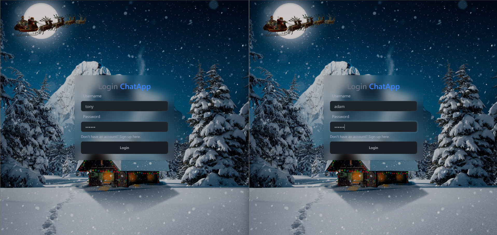
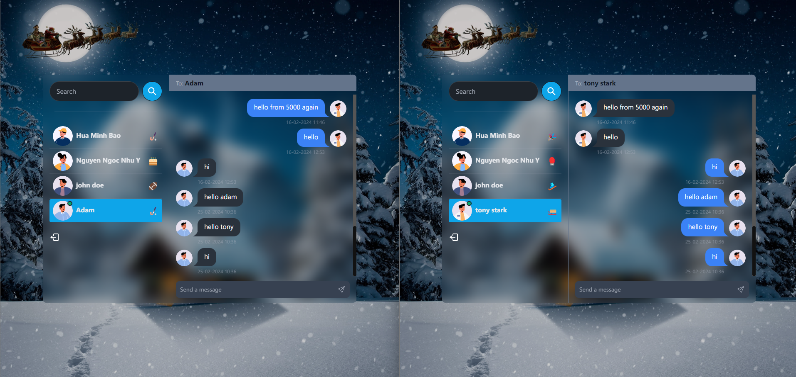

<h1>Real-time Chat Application</h1>

<h2>Features</h2>
<ul style="list-style:none;">
  <li>Authentication: Sign up, Sign in, Sign out</li>
  <li>Authorization with JsonWebToken</li>
  <li>Send Message, Get history messages</li>
  <li>Check online status of other users</li>
</ul>

  <h2>Tech stack</h2>
  <ul style="list-style:none;">
    <li>React + Tailwind CSS + DaisyUI</li>
    <li>NodeJS/ExpressJS</li>
    <li>MongoDB</li>
    <li>JsonWebToken</li>
  <ul>

<h2>Some project's images</h2>
<ul style="list-style:none;">
  <li><h3>Login page</h3></li>
  <li><h3>Home page (Chat page)</h3></li>
<ul>